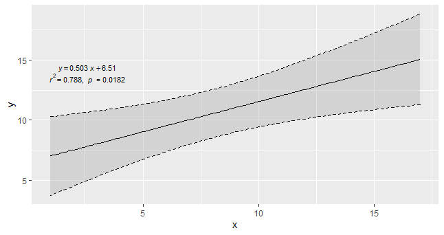
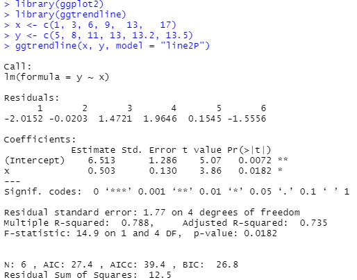
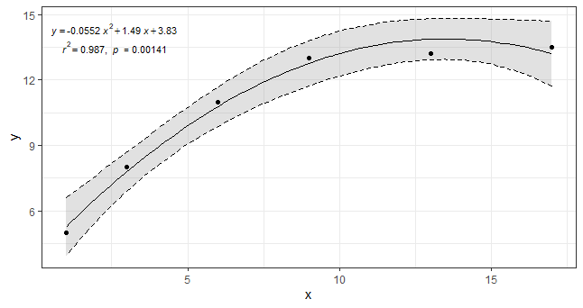
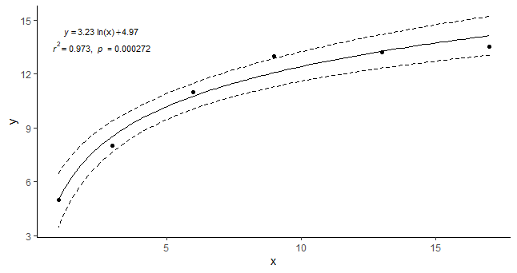
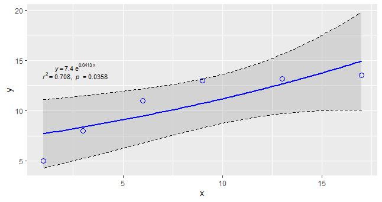
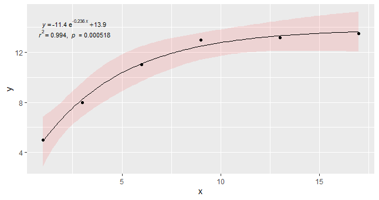

# ggtrendline: an R package for adding trendline and confidence interval to ggplot

 

## Installing "ggtrendline" package in R

1\. from Github 

You can install directly **from GitHub** if you have the devtools package installed:

    install.packages("devtools")
	library(devtools)   
	install_github("PhDMeiwp/ggtrendline@master", force = TRUE)
	library(ggtrendline)

## Using "ggtrendline" package
	
    library(ggplot2)
	library(ggtrendline)
    x <- c(1, 3, 6, 9,  13,   17)
    y <- c(5, 8, 11, 13, 13.2, 13.5)

 **[case 1]** line2P example,default
    ggtrendline(x, y, model = "line2P")  

 

 

 **[case 2]** line3P example, add geom_point()
    ggtrendline(x, y, model = "line3P") + geom_point(aes(x, y)) + theme_bw()

 

 **[case 3]** log2P example, CI lines only, without CI filling
    ggtrendline(x, y, model = "log2P", CI.fill = NA) + geom_point(aes(x, y))+ theme_classic() 
	
 

 **[case 4]**  exp2P example, set the regression line and geom_point()
    ggtrendline(x, y, model = "exp2P", linecolor = "blue", linetype = 1, linewidth = 1) + 
             geom_point(aes(x, y), color = "blue", shape = 1, size = 3)  

	
		
 **[case 5]** exp3P example, set confidence interval
    ggtrendline(x, y, model = "exp3P", CI.level = 0.99, 
                CI.fill = "red", CI.alpha = 0.1, CI.color = NA, CI.lty = 2, CI.lwd = 1.5) + 
             geom_point(aes(x, y)) 

## Details
To see more details, you can run the following R code if you have the "ggtrendline" package installed:

    library(ggtrendline)
    ?ggtrendline()

## Contact
- Bugs and feature requests can be filed to https://github.com/PhDMeiwp/ggtrendline/issues. 
- BTW, [Pull requests](https://github.com/PhDMeiwp/ggtrendline/pulls) are also welcome.